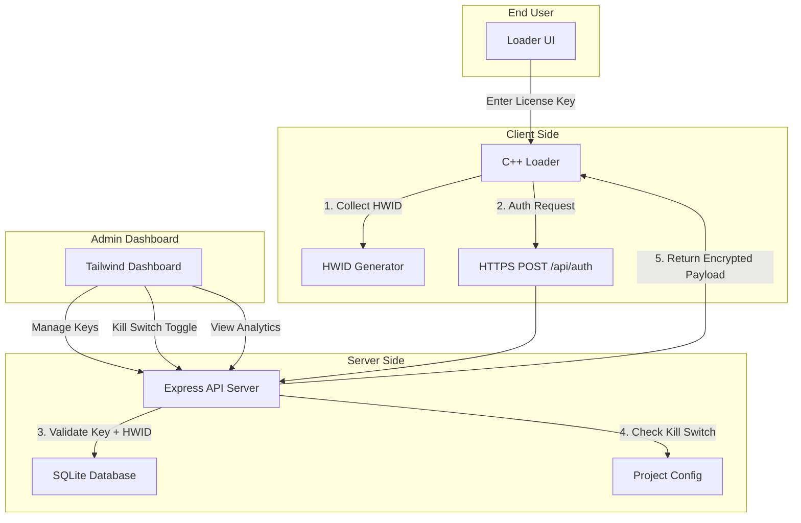

# Script Protection System — "AntiFold Shield"

A Luarmor-inspired script protection platform with modern SaaS aesthetics, multi-layered security, and a centralized license management API.

## System Overview



## Architecture — Encryption & Auth Flow

### Multi-Layered Obfuscation Pipeline

1. **Layer 1 — Constant Folding**: All numeric/string constants are replaced with runtime-computed expressions (`a XOR b`, `base64_decode(x)`)
2. **Layer 2 — Control Flow Flattening**: Function bodies are restructured into a state-machine dispatch loop
3. **Layer 3 — VM Encoding**: Core logic compiled to a custom bytecode instruction set executed by an embedded interpreter
4. **Layer 4 — AES-256-GCM Envelope**: Final payload encrypted with a per-session key derived from `HWID + timestamp + server_nonce`

### Auth Handshake Sequence

```
Client                          Server
  |-- POST /api/auth ------------>|
  |   { key, hwid, version }      |
  |                                |-- Validate key exists
  |                                |-- Check kill_switch == false
  |                                |-- Check key not expired
  |                                |-- Check key not blacklisted
  |                                |-- If hwid == null: bind hwid
  |                                |-- If hwid != req.hwid: REJECT
  |                                |-- Generate session_nonce
  |                                |-- Encrypt script with AES-256-GCM
  |                                |   key = HKDF(master_key, hwid+nonce)
  |<-- 200 { nonce, payload } ----|
  |                                |
  |-- Derive decryption key ------>|
  |-- Decrypt & execute script     |
```

### Auto-Update Check

```
Client                          Server
  |-- GET /api/version ---------->|
  |   { project_id }              |
  |                                |-- Return latest version hash
  |<-- 200 { version, hash } ----|
  |                                |
  |-- Compare local version        |
  |-- If mismatch: re-auth         |
```

---

## Database Schema (SQLite)

```sql
-- Projects table
CREATE TABLE projects (
    id          TEXT PRIMARY KEY DEFAULT (hex(randomblob(16))),
    name        TEXT NOT NULL,
    description TEXT DEFAULT '',
    api_key     TEXT NOT NULL UNIQUE DEFAULT (hex(randomblob(32))),
    script_data TEXT DEFAULT '',          -- encrypted script content
    version     TEXT DEFAULT '1.0.0',
    version_hash TEXT DEFAULT '',
    kill_switch INTEGER DEFAULT 0,        -- 0=active, 1=killed
    max_keys    INTEGER DEFAULT 100,
    created_at  DATETIME DEFAULT CURRENT_TIMESTAMP,
    updated_at  DATETIME DEFAULT CURRENT_TIMESTAMP
);

-- License keys table
CREATE TABLE keys (
    id          TEXT PRIMARY KEY DEFAULT (hex(randomblob(16))),
    project_id  TEXT NOT NULL REFERENCES projects(id) ON DELETE CASCADE,
    key_value   TEXT NOT NULL UNIQUE,      -- the actual license key
    hwid        TEXT DEFAULT NULL,          -- bound hardware ID (null = unassigned)
    discord_id  TEXT DEFAULT NULL,
    note        TEXT DEFAULT '',
    is_active   INTEGER DEFAULT 1,         -- 0=disabled, 1=active
    is_blacklisted INTEGER DEFAULT 0,
    expires_at  DATETIME DEFAULT NULL,     -- null = lifetime
    max_uses    INTEGER DEFAULT 1,
    use_count   INTEGER DEFAULT 0,
    last_ip     TEXT DEFAULT NULL,
    last_used   DATETIME DEFAULT NULL,
    created_at  DATETIME DEFAULT CURRENT_TIMESTAMP
);

-- Auth logs table
CREATE TABLE auth_logs (
    id          INTEGER PRIMARY KEY AUTOINCREMENT,
    key_id      TEXT REFERENCES keys(id),
    project_id  TEXT REFERENCES projects(id),
    hwid        TEXT,
    ip_address  TEXT,
    status      TEXT NOT NULL,             -- 'SUCCESS', 'HWID_MISMATCH', 'EXPIRED', 'KILLED', 'BLACKLISTED', 'INVALID'
    user_agent  TEXT,
    created_at  DATETIME DEFAULT CURRENT_TIMESTAMP
);

-- Index for fast lookups
CREATE INDEX idx_keys_project ON keys(project_id);
CREATE INDEX idx_keys_value ON keys(key_value);
CREATE INDEX idx_logs_project ON auth_logs(project_id);
CREATE INDEX idx_logs_created ON auth_logs(created_at);
```

---

## Proposed Changes

### Component 1 — Backend API (Node.js + Express)

Server-side license management, authentication, kill-switch, and script delivery.

#### [NEW] [package.json](file:///c:/Users/eulti/Desktop/Antifold/server/package.json)
- Express, better-sqlite3, crypto, cors, helmet, rate-limiter dependencies

#### [NEW] [server.js](file:///c:/Users/eulti/Desktop/Antifold/server/server.js)
- Main Express server with middleware stack
- API Routes:
  - `POST /api/auth` — Authenticate key + HWID, return encrypted script
  - `GET /api/version/:projectId` — Return latest version info
  - `POST /api/keys/create` — Generate new license key
  - `GET /api/keys/:projectId` — List all keys for a project
  - `PATCH /api/keys/:keyId` — Update key (toggle active, reset HWID, blacklist)
  - `DELETE /api/keys/:keyId` — Revoke key
  - `POST /api/projects/create` — Create project
  - `GET /api/projects` — List projects
  - `PATCH /api/projects/:projectId` — Update project (kill-switch, script, version)
  - `GET /api/stats/:projectId` — Dashboard analytics (total keys, active users, auth logs)
- AES-256-GCM encryption/decryption for script payloads
- HKDF key derivation from HWID + server nonce
- Rate limiting (60 req/min per IP)
- API key auth middleware for admin routes

#### [NEW] [db.js](file:///c:/Users/eulti/Desktop/Antifold/server/db.js)
- SQLite initialization with schema auto-creation
- Helper functions for all CRUD operations

#### [NEW] [crypto-utils.js](file:///c:/Users/eulti/Desktop/Antifold/server/crypto-utils.js)
- AES-256-GCM encrypt/decrypt
- HKDF key derivation
- Session nonce generation
- Key string generator (format: `AF-XXXX-XXXX-XXXX-XXXX`)

---

### Component 2 — Admin Dashboard (Tailwind CSS + Vanilla JS)

SaaS-style management interface. Clean, dark, glassmorphism. No "hacker" shit.

#### [NEW] [dashboard.html](file:///c:/Users/eulti/Desktop/Antifold/dashboard/dashboard.html)
- Full admin dashboard with:
  - **Sidebar navigation**: Projects, Keys, Logs, Settings
  - **Project overview cards**: Active keys count, total auths, kill-switch toggle
  - **Key management table**: Sortable, with inline actions (reset HWID, blacklist, delete)
  - **Auth log timeline**: Real-time feed of auth attempts with status badges
  - **Create key modal**: Generate single or bulk keys with expiry options
- Design: Inter font, charcoal/slate dark theme, glassmorphism cards, soft transitions
- Tailwind CSS via CDN

#### [NEW] [dashboard.js](file:///c:/Users/eulti/Desktop/Antifold/dashboard/dashboard.js)
- API client for all admin endpoints
- Dynamic DOM rendering
- Real-time stats polling
- Toast notifications for actions

---

### Component 3 — End-User Loader UI

Ultra-minimalist. Single input. Nothing else.

#### [NEW] [loader.html](file:///c:/Users/eulti/Desktop/Antifold/loader/loader.html)
- Centered single license key input field
- Glassmorphism container on dark gradient background
- Border color transitions:
  - Default: subtle slate border
  - Processing: soft blue glow (`#3B82F6`)
  - Success: muted green glow (`#10B981`)
  - Error: muted red glow (`#EF4444`)
- Inter font, minimal text ("Enter your license key")
- Smooth fade/scale animations on state changes
- No logos, no extra text, no bullshit

---

### Component 4 — C++ Client Loader

Lightweight native binary that handles HWID collection, server auth, and script delivery.

#### [NEW] [loader.cpp](file:///c:/Users/eulti/Desktop/Antifold/client/loader.cpp)
- HWID generation: Combine `GetVolumeInformation` (disk serial) + `GetComputerName` + CPU ID (via `__cpuid`) → SHA256 hash
- HTTPS POST to `/api/auth` with `{key, hwid, version}`
- Parse JSON response, extract nonce + encrypted payload
- AES-256-GCM decryption using HKDF-derived key
- Auto-update check against `/api/version`
- Clean error handling with user-friendly messages
- Uses WinHTTP for HTTPS, CNG (bcrypt.h) for crypto — zero external dependencies

#### [NEW] [loader.h](file:///c:/Users/eulti/Desktop/Antifold/client/loader.h)
- Structs, function declarations, constants

#### [NEW] [build.bat](file:///c:/Users/eulti/Desktop/Antifold/client/build.bat)
- MSVC build script: `cl.exe /O2 loader.cpp /link winhttp.lib bcrypt.lib advapi32.lib`

---

## Project Structure

```
Antifold/
├── server/                  # Backend API
│   ├── package.json
│   ├── server.js            # Express API server
│   ├── db.js                # SQLite database layer
│   └── crypto-utils.js      # Encryption utilities
├── dashboard/               # Admin dashboard
│   ├── dashboard.html       # Tailwind CSS admin UI
│   └── dashboard.js         # Dashboard logic
├── loader/                  # End-user loader UI
│   └── loader.html          # Minimalist key input
├── client/                  # C++ native loader
│   ├── loader.cpp           # HWID + auth + decrypt
│   ├── loader.h             # Headers
│   └── build.bat            # Build script
└── executor/                # (existing)
    ├── injector.c
    ├── test_dll.c
    └── build.bat
```

---

## Verification Plan

### Automated Tests
1. Start the Express server, create a test project and key via API
2. Auth with correct key → expect 200 + encrypted payload
3. Auth with wrong HWID → expect 403 HWID_MISMATCH
4. Auth with killed project → expect 403 PROJECT_KILLED
5. Auth with expired key → expect 403 KEY_EXPIRED
6. Auth with blacklisted key → expect 403 KEY_BLACKLISTED
7. Version check endpoint returns correct hash

### Manual Verification
1. Open dashboard.html, verify UI renders properly with glassmorphism
2. Open loader.html, test input field color transitions
3. Build C++ loader with MSVC, verify HWID generation
4. Full end-to-end: create project → create key → auth via loader → receive script
